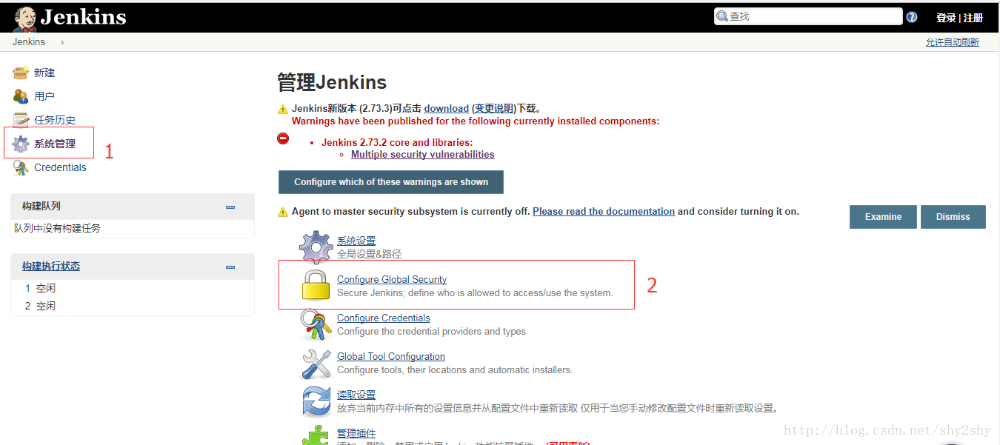

# dea、jira和jenkins的集成
[转载](https://blog.csdn.net/yan1234abcd/article/details/52086931)

## 一、各个插件环境的配置
### 1.1 idea中的插件安装
#### 1.1.1 安装jira插件
 插件安装此处省略。。。。
 
1.jira插件的配置

File -> Settings ->Task -> Servers 点击右侧上面的+号，选择JIRA，然后输入JIRA的Server地址，用户名、密码即可

2.在idea中，然后打开OpenTask界面

3.如果JIRA中有分配给你的Task，idea能自动列出来

4.选择一个task后

5.代码修改后，向Git提交时，会自动与该任务关联

将每次提交的代码修改与JIRA上的TASK关联后，有什么好处呢？我们每天可能要写很多代码，修复若干bug，日子久了以后，谁也不记得当初为了修复某个bug做了哪些修改，不要紧张，只要你按上面的操作正确提交，idea都会帮你记着这些细节

如上图，选择最近提交的TASK列表，选择Switch to，idea就会自动打开该TASK关联的源代码，并定位到修改过的代码行。当然如果该TASK已经Close了，也可以选择Remove将其清空。

#### 1.1.2 安装jenkins插件
 插件安装此处省略。。。。
 
1.jenkins插件的配置

### 1.2 jira中的安装jenkins插件

#### 1.2.1 jira中需要安装的插件,在jira管理—>插件中，查找并安装该插件

#### 1.2.2 jira中jenkins插件配置

在jira中添加jenkins连接，先在jira管理—>插件，添加应用程序连接

在输入框中输入Jenkins的URL，然后点击旁边按钮

点击“Continue”,填写信息

继续点击“Continue”,则会出现下图所示的连接信息

之后点击"Edit",填写jenkins的用户名和密码等信息

在jira中配置jenkins

配置好后就应该可以看到jenkins的job了

### 1.3 jenkins中的安装jira插件

#### 1.3.1 插件安装

在jira管理—>插件中，查找并安装该插件

Jenkins中需要安装以下几个插件

Jenins中有一个插件需要通过手动下载并安装

https://marvelution.atlassian.net/wiki/display/JJI/1.4.1

http://repository.marvelution.com/content/repositories/releases/com/marvelution/jira/plugins/jenkins-jira-plugin/1.4.1/

在Jenkins中配置，系统设置（这里需要注意jira和jenkins如果是安装在不同机器上，应该保证防火墙对两个应用程序的端口是开放的）

Jenkins中项目配置

### 1.4 IntelliJ配置jenkins服务的Crumb Data

[转载](https://blog.csdn.net/shy2shy/article/details/78525543)

首先在jenkins服务器中开启CSRF服务，点击左边系统管理中的Configure Global Security，如下图所示：

点击Settings中的Tools，选中Jenkins Plugins，根据安装情况配置，如图:

由于Jenkins是安装在tomcat下的，所以Server Address设置为http://127.0.0.1:8080/jenkins/，其中127.0.0.1代表本机地址； 

User为默认的admin； 

Password可在C:\Users\Administrator.jenkins\secrets目录下的initialAdminPassword文件中找到； 

Jenkins version：目前安装的基本都为ver 2.x 

Crumb Data：通过http://jenkinsserver:port/crumbIssuer/api/xml?tree=crumb#查看，其中jenkinsserver:port即为本机的Jenkins访问地址；

